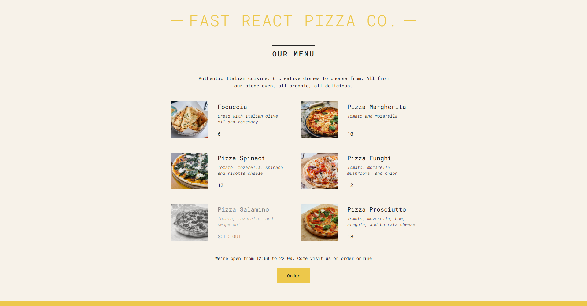

# 🍕 Pizza Menu App

A **modern React application** that displays a dynamic pizza menu using reusable components and clean UI design.

This project demonstrates **React fundamentals such as component architecture, props, conditional rendering, and rendering lists from data** while building a real-world styled menu interface.

It is designed as a **learning project to practice building reusable UI components and structuring React applications properly.**

---

## 🚀 Demo

Live Demo (Optional – add if deployed)

```
https://pizza-menu-app-six.vercel.app/
```

---

# 📸 Application Preview



---

# ✨ Features

* Dynamic pizza menu rendered from data
* Clean component-based architecture
* Reusable UI components
* Conditional rendering for menu availability
* Responsive layout
* Organized project structure

---

# 🛠️ Tech Stack

| Technology        | Purpose            |
| ----------------- | ------------------ |
| React.js          | UI development     |
| JavaScript (ES6+) | Application logic  |
| HTML5             | Page structure     |
| CSS3              | Styling and layout |

---

# 🧠 React Concepts Demonstrated

This project demonstrates important **React core concepts**:

### 1️⃣ Component-Based Architecture

The UI is broken into reusable components:

* Header
* Menu
* Pizza
* Footer

This improves **modularity and maintainability**.

---

### 2️⃣ Props

Data is passed between components using **props**, allowing components to remain reusable and flexible.

Example concept:

```
<Pizza name="Pepperoni" price={12} ingredients="Tomato, Cheese, Pepperoni" />
```

---

### 3️⃣ Rendering Lists with `map()`

Menu items are rendered dynamically from a **data array**.

This is a common React pattern when displaying collections.

---

### 4️⃣ Conditional Rendering

The app shows whether the restaurant is **open or closed** depending on the time.

This demonstrates conditional UI logic in React.

---

# 📂 Project Structure

```
pizza-menu-app
│
├── public
│
├── src
│   │
│   ├── App.js
│   ├── index.js
│   ├── data.js
│   │
│   └── components
│        ├── Header.js
│        ├── Menu.js
│        ├── Pizza.js
│        └── Footer.js
│
├── package.json
└── README.md
```

---

# ⚙️ Installation & Setup

### 1️⃣ Clone the repository

```bash
git clone https://github.com/SuryaTejaTangella/pizza-menu-app.git
```

---

### 2️⃣ Navigate into the project

```bash
cd pizza-menu-app
```

---

### 3️⃣ Install dependencies

```bash
npm install
```

---

### 4️⃣ Run the application

```bash
npm start
```

The app will run on:

```
http://localhost:3000
```

---

# 📈 Future Improvements

Potential enhancements for this project:

* Add filtering (Veg / Non-Veg pizzas)
* Add search functionality
* Integrate a cart system
* Add animations
* Improve responsive design
* Fetch menu data from an API

---

# 🎯 Learning Outcome

Through this project I practiced:

* Building React applications from scratch
* Structuring UI with reusable components
* Managing UI data using arrays and objects
* Implementing conditional rendering
* Writing clean and readable React code

---

# 👨‍💻 Author

**Surya Teja Tangirala**

Aspiring **Software Developer transitioning from Banking to FinTech/IT**, building projects in:

* Java
* JavaScript
* React
* Backend Development

GitHub
[https://github.com/SuryaTejaTangella](https://github.com/SuryaTejaTangella)

Linkedin
https://www.linkedin.com/in/suryatejatangella/

---

# ⭐ Support

If you found this project helpful:

⭐ Star the repository
🍴 Fork it to build your own version

---

💡 *This project is part of my journey of building practical frontend projects and strengthening my React fundamentals.*

---